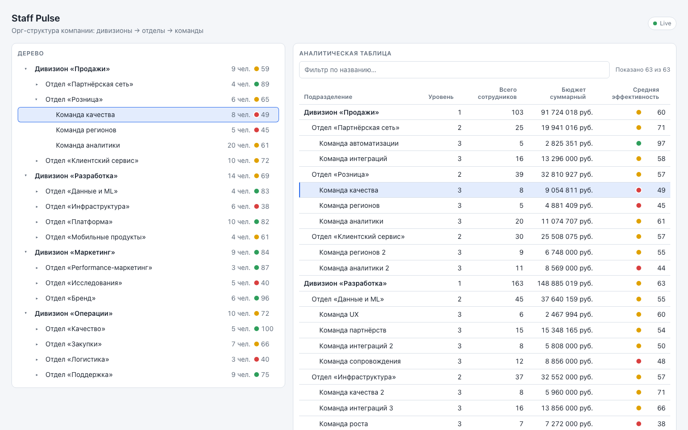
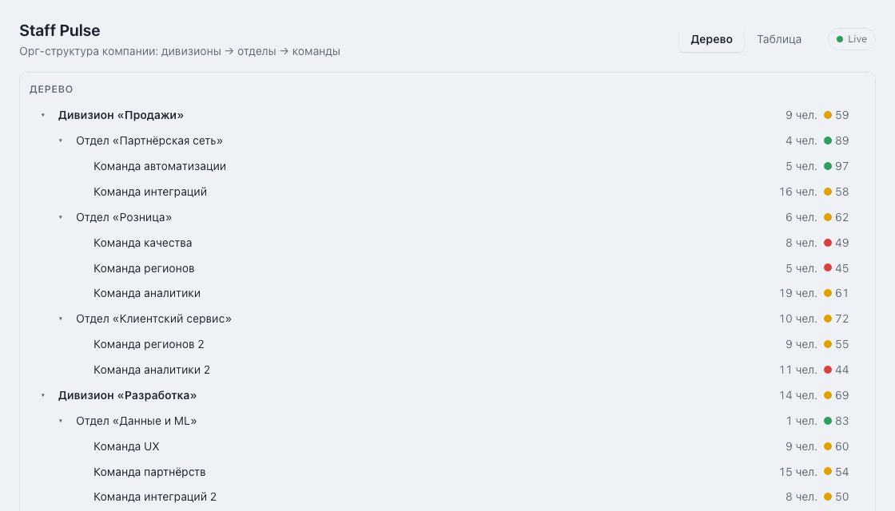
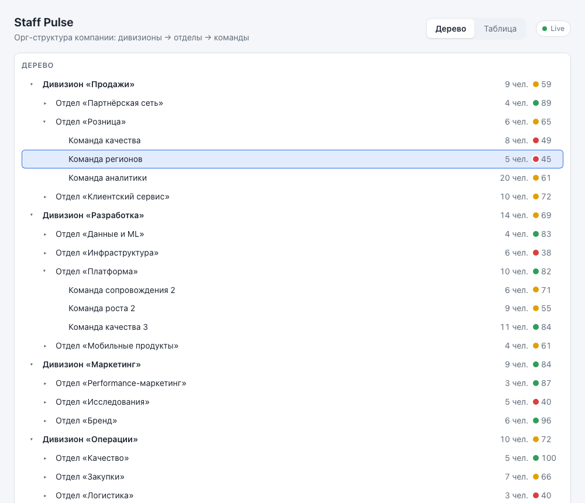
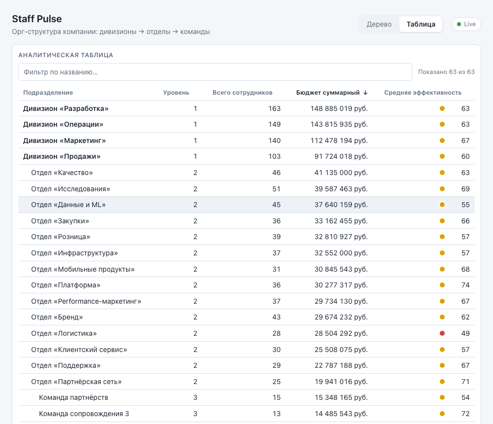
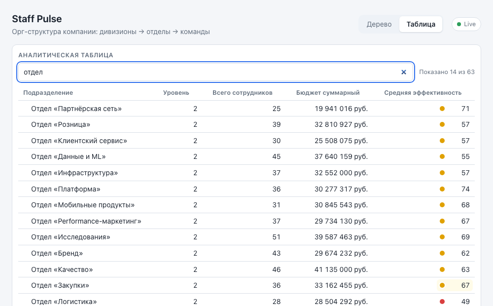
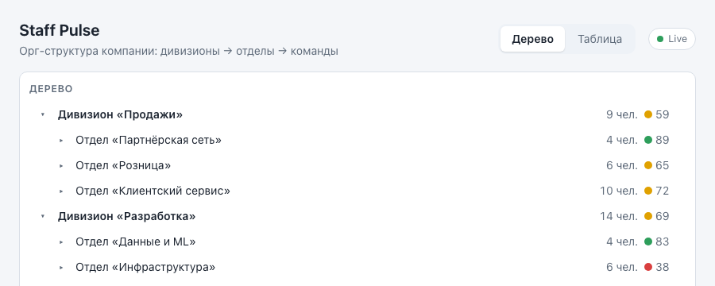
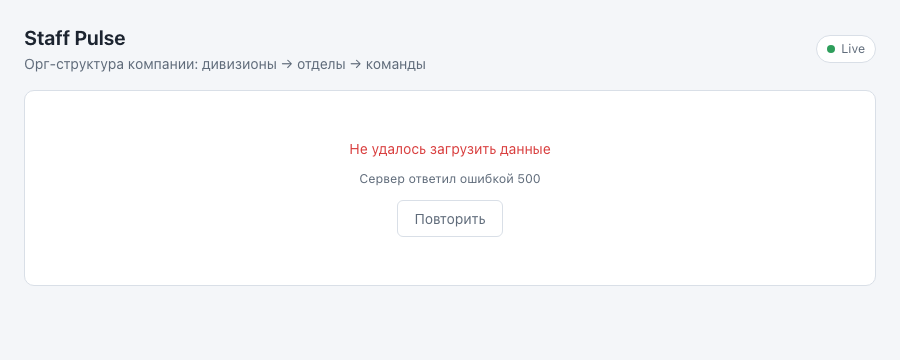
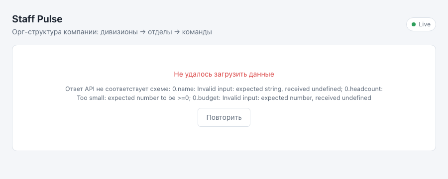
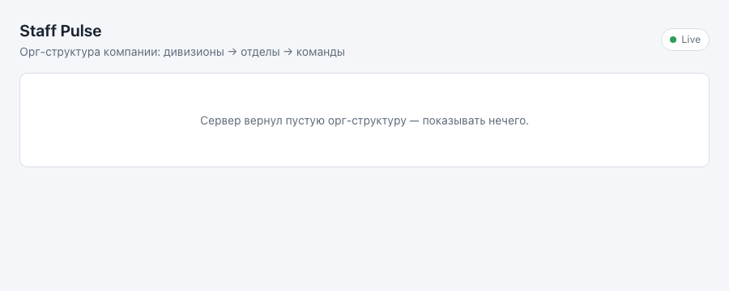

# Staff Pulse

Дашборд для мониторинга орг-структуры компании: **дивизионы → отделы → команды**.
Интерактивное дерево с численностью и индикатором эффективности, аналитическая
таблица с агрегированными показателями, live-обновления с сервера по SSE.



## Запуск одной командой

Нужен Node.js 20+.

```bash
npm install && npm run dev
```

Поднимаются два процесса:

| Что                      | Адрес                                                                   |
| ------------------------ | ----------------------------------------------------------------------- |
| Клиент (Vite dev server) | http://localhost:5173                                                   |
| Mock API                 | http://localhost:4000 (`GET /api/org-tree`, SSE `/api/org-tree/events`) |

Клиент проксирует `/api` на сервер, поэтому в браузере достаточно открыть 5173.

Прод-сборка и запуск одним процессом (сервер раздаёт собранный клиент):

```bash
npm run build && npm start
```

## Что умеет

- **Дерево:** раскрытие и скрытие веток с анимацией высоты, второй уровень открыт по
  умолчанию, у каждого узла — название, численность и цветовой индикатор эффективности.
  Навигация с клавиатуры: ↑ ↓ по видимым узлам, → раскрыть / к первому ребёнку,
  ← свернуть / к родителю, Home/End, Enter — выбрать.
- **Таблица:** подразделение, уровень, всего сотрудников, суммарный бюджет и средняя
  эффективность с учётом всех потомков (среднее взвешено по численности). Сортировка
  кликом по заголовку, двойной клик — в обратном порядке. Фильтр по названию с дебаунсом
  250 мс. Клик по строке выделяет узел в дереве и раскрывает его ветку. Клавиатура:
  ↑ ↓ Home End по строкам, Enter — выбрать.
- **Режимы:** до 1280px — переключатель «Дерево / Таблица», от 1280px — split-view.
- **Live-обновления:** сервер раз в 2–5 с меняет показатели случайного узла и шлёт патч
  по SSE. Клиент применяет его в кэш без рефетча, пересчитывает агрегаты только для
  затронутого узла и его предков, а обновлённые ячейки подсвечиваются с затуханием ~1.5 с.
  При обрыве — экспоненциальный backoff с джиттером, индикатор в шапке показывает
  попытки; при переподключении сервер досылает пропущенные патчи по `Last-Event-ID`,
  полный рефетч происходит только если история потеряна.
- **Надёжность:** валидация ответа схемой (zod), состояния загрузки / ошибки / пустого
  ответа, отмена запроса при размонтировании, ETag/304, `prefers-reduced-motion`.



## Стек

- **Клиент:** React 19, TypeScript, Vite, styled-components, TanStack Query (кэш), zod (валидация).
- **Сервер:** Node.js, Express, TypeScript. Данные генерируются детерминированно в памяти, БД нет.
- Монорепозиторий на npm workspaces: `client/` и `server/`.

## Проверка состояний вручную

Параметры `scenario` и `delay` из адреса страницы пробрасываются в запрос к API:

| Адрес                                     | Что показывает                            |
| ----------------------------------------- | ----------------------------------------- |
| `http://localhost:5173/?scenario=error`   | ошибка сервера (500) и кнопка «Повторить» |
| `http://localhost:5173/?scenario=empty`   | пустой ответ                              |
| `http://localhost:5173/?scenario=invalid` | ответ, не прошедший валидацию схемы       |
| `http://localhost:5173/?delay=3000`       | состояние загрузки                        |

Обрыв соединения: остановите сервер (`Ctrl+C` в терминале или `kill` процесса `tsx`) —
индикатор перейдёт в «Переподключение через N с», после запуска сервера вернётся «Live».
Поток можно смотреть напрямую: `curl -N localhost:4000/api/org-tree/events`.

## Скрипты

| Команда             | Что делает                                   |
| ------------------- | -------------------------------------------- |
| `npm run dev`       | сервер + клиент в режиме разработки          |
| `npm run build`     | сборка сервера и клиента                     |
| `npm start`         | запуск собранного приложения одним процессом |
| `npm test`          | unit-тесты (vitest)                          |
| `npm run lint`      | ESLint для клиента и сервера                 |
| `npm run typecheck` | проверка типов                               |
| `npm run format`    | Prettier                                     |

## Этапы

Каждый этап — отдельный коммит с тегом `step/N`.

- [x] `step/1` FOUNDATION — проект, mock API, валидация, кэш, дерево, состояния
- [x] `step/2` CORE — аналитическая таблица, сортировка, фильтр, split-view
- [x] `step/3` POLISH — live-обновления по SSE, подсветка ячеек, клавиатура, backoff

## Документация

- [docs/architecture.md](docs/architecture.md) — слои приложения и поток данных от API до UI
- [docs/data-model.md](docs/data-model.md) — дерево, алгоритм агрегации, контракт live-патча
- [docs/adr/](docs/adr/) — architecture decision records:
  - [001](docs/adr/001-cache-and-fetching.md) — кэш и загрузка (TanStack Query + ETag)
  - [002](docs/adr/002-styling.md) — styled-components и тема-токены
  - [003](docs/adr/003-table-sorting-and-split-view.md) — таблица: сортировка, фильтр, split-view
  - [004](docs/adr/004-live-updates-sse.md) — SSE и досылка пропущенных патчей
  - [005](docs/adr/005-incremental-aggregation.md) — один источник правды и инкрементальные агрегаты
  - [006](docs/adr/006-cell-flash.md) — подсветка обновлённых ячеек

## Скриншоты

| Дерево                                  | Таблица                                   |
| --------------------------------------- | ----------------------------------------- |
|  |  |

| Фильтр                                          | Загрузка                                     |
| ----------------------------------------------- | -------------------------------------------- |
|  |  |

| Ошибка сервера                           | Невалидный ответ                               | Пустой ответ                            |
| ---------------------------------------- | ---------------------------------------------- | --------------------------------------- |
|  |  |  |

## Тесты

```bash
npm test
```

- `shared/model/orgModel.test.ts` — построение дерева и **агрегация**: суммы по потомкам,
  взвешенная по численности эффективность, уровни, пустой ответ, узлы-сироты, мемоизация.
- `shared/model/patchModel.test.ts` — инкрементальный пересчёт: затрагиваются только узел
  и предки, соседние поддеревья сохраняют ссылки, 300 случайных патчей совпадают с полной
  пересборкой.
- `shared/model/applyPatch.test.ts` — применение патча к кэшу без лишних копий.
- `shared/live/liveClient.test.ts` — статусы, backoff 1→2→4… с потолком 30 с, `lastEventId`
  при реконнекте, сторожевой таймер, resync, офлайн, остановка.
- `features/highlights/cellHighlights.test.ts` — хранилище подсветок и выбор ячеек для патча.
- `shared/api/schema.test.ts`, `shared/api/orgTreeApi.test.ts` — валидация схемы, 304/500,
  проброс AbortSignal.
- `features/tree/*.test.tsx`, `features/table/*.test.tsx` — дерево и таблица, включая
  клавиатурную навигацию, сортировку, фильтр с дебаунсом, формат «12 345 678 руб.».

## AI в разработке

Основной инструмент — **Claude Code** (Anthropic). Он использовался на всех этапах как
пара-программист: генерировал каркас и большую часть кода по согласованной архитектуре,
писал тесты и черновики документации, снимал скриншоты через headless Chromium.

**Что делал AI**

- Каркас монорепозитория (Vite/React/TS, Express, ESLint/Prettier/vitest, CI).
- Генератор мок-данных, REST-эндпоинт с ETag/304 и dev-сценариями, SSE-сервер с буфером
  патчей и досылкой по `Last-Event-ID`.
- Слой данных на TanStack Query, zod-схемы, модель дерева с инкрементальной агрегацией,
  live-клиент с backoff и сторожевым таймером, хранилище подсветок.
- Компоненты дерева и таблицы, клавиатурная навигация, styled-components-тема.
- Unit-тесты (в том числе property-подобный тест «300 случайных патчей ≡ полная пересборка»)
  и первые версии `docs/*` и ADR.

**Что решал и проверял человек**

- Архитектурные решения принимались до кода и зафиксированы в ADR: транспорт live-обновлений
  на SSE с досылкой пропусков по `Last-Event-ID`, кэш react-query как единственный источник
  правды для патчей, мемоизация модели по ссылке на данные, подсветка ячеек через
  CSS-анимацию и React-key.
- Ревью каждого этапа: упрощение предложенных AI вариантов (например, отказ от хранения
  раскрытых веток через `setState` во время рендера в пользу производного значения).
- Ручная проверка в браузере, а не только тесты. Так были найдены и исправлены реальные
  проблемы: Vite-прокси не транслирует обрыв бэкенда в открытый SSE-ответ (индикатор
  оставался «Live» — добавлены обработчики `error`/`proxyRes close` в конфиг прокси);
  сортировка по названию по умолчанию ломала чтение иерархии (по умолчанию — порядок
  дерева); одинаковые названия команд в разных отделах выглядели как дубли (генератор
  нумерует повторы).
- Финальная правка формулировок в документации и README.
